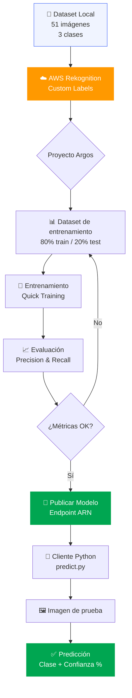
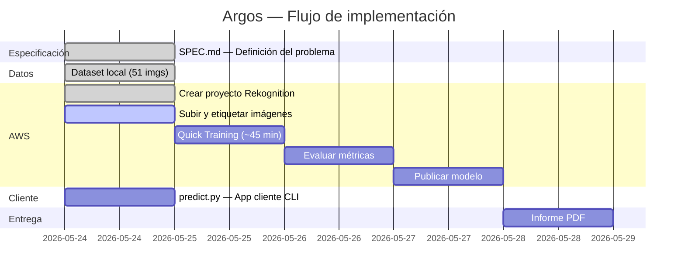
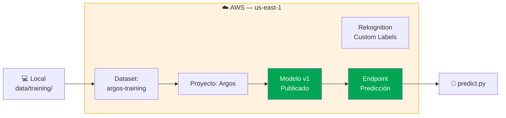

# Argos — Clasificador de Imágenes de Animales Salvajes

> *Argos Panoptes: el gigante de cien ojos de la mitología griega que todo lo veía.*  
> *Para un modelo de visión por computador, un nombre perfecto.*

[](https://aws.amazon.com/rekognition/custom-labels-features/)
[](https://python.org)
[](https://www.lasalle.edu.co)

---

## 👥 Autores

| Nombre | Rol |
|--------|-----|
| **María Alejandra Gómez Piedrahita** | Investigadora principal |
| **Juan Manuel Castillo Pinto** | Arquitecto de solución |

**Materia:** 2026-1 · VISIÓN POR COMPUTADOR · G02  
**Actividad:** 4 — Unidad 2: Técnicas de entrenamiento y optimización para modelos de visión por computador  
**Universidad:** La Salle — Maestría en Inteligencia Artificial

---

## 🎯 ¿Qué hace Argos?

Argos es un modelo de clasificación de imágenes entrenado en **AWS Rekognition Custom Labels** capaz de identificar automáticamente tres animales salvajes africanos:

| Clase | Animal | Imágenes de entrenamiento |
|-------|--------|--------------------------|
| `elephant` | Elefante africano | 17 |
| `giraffe` | Jirafa | 17 |
| `lion` | León | 17 |

---

## 🏗️ Arquitectura



---

## 🔄 Flujo del proyecto (Spec Driven Design)



---

## 📁 Estructura del proyecto

```
Argos/
├── README.md                    # Este archivo
├── SPEC.md                      # Especificación Spec Driven Design
├── .gitignore
│
├── data/
│   ├── training/
│   │   ├── elephant/            # 17 imágenes de elefantes
│   │   ├── giraffe/             # 17 imágenes de jirafas
│   │   └── lion/                # 17 imágenes de leones
│   └── test/                    # Imágenes para prueba del cliente
│
├── src/
│   ├── client/
│   │   └── predict.py           # 🐍 App cliente — prueba el modelo
│   └── utils/
│       └── upload_dataset.py    # Utilidades de carga
│
├── docs/
│   ├── training_results.md      # Métricas post-entrenamiento
│   ├── architecture.md          # Decisiones de arquitectura
│   └── screenshots/             # Evidencia del proceso AWS
│
└── informe/
    └── informe_actividad4.md    # Informe académico
```

---

## 🚀 Guía de reproducción paso a paso

### Prerrequisitos

```bash
pip install boto3 pillow
aws configure  # Configurar credenciales AWS
```

### 1. Clonar el repositorio

```bash
git clone https://github.com/jmmana/Maestria-Vision-Computador-Clasificacion.git
cd Argos
```

### 2. Configurar AWS CLI

```bash
aws configure
# AWS Access Key ID: <tu-key>
# AWS Secret Access Key: <tu-secret>
# Default region: us-east-1
# Output format: json
```

### 3. Subir el modelo y predecir

```bash
# Prueba de predicción (una vez publicado el modelo)
python src/client/predict.py \
  --image data/test/mi_animal.jpg \
  --project-arn <ARN-del-proyecto> \
  --model-arn <ARN-del-modelo>
```

### Ejemplo de salida

```
🔍 Analizando imagen: mi_animal.jpg
━━━━━━━━━━━━━━━━━━━━━━━━━━━━━
✅ Predicción: ELEPHANT
   Confianza: 94.7%
━━━━━━━━━━━━━━━━━━━━━━━━━━━━━
```

---

## 📸 Proceso de implementación en AWS

### 1. Crear conjunto de datos


### 2. Configuración 80% entrenamiento / 20% prueba


### 3. Agregar imágenes al conjunto de datos


### 4. Crear etiquetas (elephant · giraffe · lion)


### 5. Dataset completo — 17 imágenes por categoría


### 6. Detalle del conjunto de datos


### 7. Configuración del modelo de entrenamiento


### 8. Entrenamiento en progreso


> Ver el manual completo en [`docs/MANUAL_AWS.md`](docs/MANUAL_AWS.md)

---

## 📊 Resultados del modelo

> 📝 *Esta sección se completa después del entrenamiento.*  
> Ver [`docs/training_results.md`](docs/training_results.md) para las métricas completas.

| Clase | Precision | Recall | F1 |
|-------|-----------|--------|----|
| Elephant | — | — | — |
| Giraffe | — | — | — |
| Lion | — | — | — |
| **Promedio** | — | — | — |

---

## ☁️ Infraestructura AWS



---

## 📋 Criterios de evaluación

| Criterio | Puntos | Estado |
|----------|--------|--------|
| Creación y configuración del recurso AWS AI Services | 1 | ✅ |
| Creación y configuración del proyecto Custom Labels | 2 | ✅ |
| Entrenamiento y evaluación del modelo | 1 | ⏳ |
| Publicar y probar con app cliente | 1 | ⏳ |
| **Total** | **5** | |

---

## 📚 Referencias

- [Amazon Rekognition Custom Labels — Documentación oficial](https://docs.aws.amazon.com/rekognition/latest/customlabels-dg/what-is.html)
- [Boto3 Rekognition — SDK Python](https://boto3.amazonaws.com/v1/documentation/api/latest/reference/services/rekognition.html)
- [Dataset de animales](data/training/)

---

## 📄 Licencia

Proyecto académico — La Salle, Maestría en Inteligencia Artificial, 2026.
